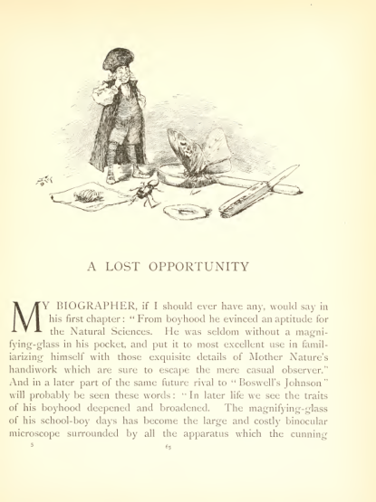

# Outputs generated, by image  
**Prompt used:** 'SER: Describe the image exhaustively. Ignore all text and focus on the illustration only. Your description should include action descriptio'  
### ./20_samples/lifedeathjennywr00newyiala_page1.png:  
  
The image is a vintage book cover with a charming illustration style. At the center of the image, there is a bird perched on a branch. The bird is depicted with a rich, dark plumage, and its head is turned to the left, as if it is looking at something off-frame. The branch on which the bird is perched is adorned with green leaves, suggesting a natural, outdoor setting.

Below the bird, there is a small birdhouse with a blue roof, which adds a pop of color to the scene. The birdhouse is situated on the ground, and it appears to be empty, with no birds visible inside.

The background of the image is a light beige color, which contrasts with the darker tones of the bird and the birdhouse. This contrast helps to draw the viewer's attention to the central elements of the illustration.

The overall composition of the image is balanced, with the bird and the birdhouse being the main focal points. The bird's position on the branch and the birdhouse on the ground create a sense of depth in the image. The illustration is detailed, with careful attention given to the textures of the feathers, the leaves, and the birdhouse.

The image does not depict any action, but rather a still life scene. The bird is perched calmly on the branch, and the birdhouse is stationary on the ground. The image does not contain any text or additional elements that would suggest movement or action. The relative positions of the objects are static, with the bird above the birdhouse, and both on the ground level. The image is a snapshot of a quiet moment in nature, captured in the form of a book cover illustration.  
***  
### ./20_samples/selecttalesinpro00parliala_page213.png:  
  
The image is a black and white illustration that appears to be from a book cover. The illustration depicts a scene with several figures that are not clearly distinguishable due to the style and quality of the image. The figures are arranged in a way that suggests a narrative or a group of people engaged in some activity. The style of the illustration is reminiscent of engravings from the 19th century, with fine lines and shading that give depth to the image.

The illustration is framed by a decorative border that includes floral and geometric patterns, which is typical of the aesthetic of the time period. The text on the image is in a serif font, which is also characteristic of the era. The text is arranged in a hierarchical manner, with the title "FIRESIDE VERSES" at the top in a larger font size, followed by "Beautifully Illustrated" in a slightly smaller font, and the author's name "By Mary Howitt" at the bottom.

The price of the book, "Price 1s.," is noted at the bottom of the image, along with the phrase "With nearly Fifty Woodcuts," indicating that the book contains a number of illustrations. The text also includes a reference to "The Gospel Preached to Babes," which is likely the title of one of the poems or stories included in the book. The overall impression is that of a vintage book cover, designed to be both informative and visually appealing to potential readers.  
***  
### ./20_samples/storiesforhouseh00andeiala_page104.png:  
  
The image is a black and white illustration that captures a poignant scene of a mother and child. The mother, dressed in a long dress, is seated on a chair, her attention focused on the child who is lying in a bed. The child, clad in a nightgown, is in a state of rest, their head comfortably nestled on a pillow. The mother's hand gently rests on the child's head, a gesture of care and affection. The room they are in is modestly furnished, with a window and a door visible in the background. The overall atmosphere of the image is one of quiet domesticity and familial love.  
***  
### ./20_samples/littlemaryorpict00ceciiala_page21.png:  
  
The image is a black and white illustration that captures a moment of a young girl named Little Mary. She is standing on a rail, her body leaning forward with a sense of urgency. Her gaze is directed downwards, and her hands are clenched into fists, suggesting a state of agitation or determination. The illustration is rich in detail, with the girl's hair and clothing rendered with precision. The background is minimal, allowing the focus to remain on Little Mary and her actions. The image does not contain any text. The overall composition of the illustration conveys a sense of movement and emotion.  
***  
### ./20_samples/daisycaution00turniala_page44.png:  
  
The image is a black and white illustration from a book, specifically page 43. The illustration depicts a scene with two characters. On the left, there is a man who appears to be in a state of distress or discomfort, as he is holding his head with his hands. He is dressed in a long coat and a hat, suggesting a formal or possibly historical setting. On the right, there is a woman who is holding out a hat to the man. She is wearing a dress and a bonnet, which are typical attire for women in certain historical periods. The woman's posture and the hat she is holding suggest she might be offering it to the man. The background of the illustration is minimal, with a hint of a building and a tree, providing a simple backdrop that focuses attention on the interaction between the two characters. The style of the illustration is reminiscent of traditional book illustrations, with a clear and detailed depiction of the characters and their actions.  
***  
### ./20_samples/inquisitivejackh00goodiala_page39.png:  
  
The image is a black and white illustration from a book, specifically Chapter IV of "Inquisitive Jack." The illustration depicts a scene with two beetles. One beetle is positioned on the left side of the image, and the other is on the right. The beetle on the left is shown in a state of rest, lying on its back on the ground. The beetle on the right is shown in a state of motion, walking on its hind legs. The beetles are detailed, with visible antennae and legs, and the beetle on the right is also shown with its wings spread out. The illustration captures a moment of contrast between the resting and active states of the beetles.  
***  
### ./20_samples/ursulaathome00grif_page275.png:  
  
The image is a black and white photograph featuring a single subject, a dog. The dog appears to be a medium-sized breed with a fluffy coat, possibly a breed like a Samoyed or a similar breed with a thick, white fur. The dog is facing the camera directly, and its expression is neutral. The background is dark, which contrasts with the dog's white fur, making the dog the central focus of the image. The dog's fur is well-groomed, and there are no visible signs of movement or action in the image. The style of the photograph is realistic, capturing the dog in a clear and detailed manner. There are no texts or other objects in the image.  
***  
### ./20_samples/chitchatorshortt00buddiala_page96.png:  
  
The image is a black and white illustration from a book, depicting a scene with two characters. The illustration is framed by a decorative border at the top and bottom, with the title "CHIT-CHAT" in the upper left corner and the page number "89" in the upper right corner.

In the scene, a woman is seated at a table, her posture relaxed with her hands resting on the table. She is dressed in a long dress with a high collar, and her hair is styled in an updo. Beside her, a man is standing, leaning slightly forward with his hands clasped together. He is wearing a suit with a tie, and his posture suggests a formal or polite interaction.

The table between them is adorned with a few items, including a vase and a book, which are placed on the tabletop. The background is minimal, with a simple wall and a window, allowing the focus to remain on the two characters and their interaction. The style of the illustration is reminiscent of classic book illustrations, with attention to detail in the clothing and the setting, and a sense of realism in the depiction of the characters.  
***  
### ./20_samples/museedepoup00pari_page56.png:  
  
The image is a black and white illustration, likely from a book or a historical document, depicting a person standing in a pose that suggests movement or action. The individual is wearing a long dress with a high collar and a large, elaborate hat adorned with what appears to be feathers or a similar decorative element. The dress has a full skirt that flares out, and the person's arms are raised, with one hand resting on the hip and the other extended outward, as if gesturing or dancing. The person's face is not visible, as the illustration focuses on the upper body and the attire. The style of the illustration is reminiscent of historical fashion plates, with attention to detail in the clothing and the posture of the figure.  
***  
### ./20_samples/oldwomanthesilve00londiala_page5.png:  
  
The image is a vintage illustration from a book titled "The Silver Penny." It features two distinct scenes, each with a central figure and a background.

In the upper scene, a woman is depicted in a dynamic pose, standing on a rocky outcrop with her arms outstretched as if embracing the landscape. She is dressed in a long, flowing dress with a pattern that suggests a historical or fantasy setting. The background shows a rugged terrain with a body of water and a distant view of a castle or fortress.

The lower scene is a more intimate portrayal of a woman and a dog. The woman is seated on a bench, her posture relaxed, and she is looking down at the dog with a gentle expression. The dog is lying on the ground, looking up at the woman with a contented demeanor. The background of this scene is a serene landscape with trees and a clear sky.

The illustration style is reminiscent of classic children's book art, with a focus on storytelling through the depiction of characters and their interactions with their environment. The use of color is limited, with a palette that emphasizes earth tones and muted hues, which contributes to the timeless and nostalgic feel of the artwork.  
***  
### ./20_samples/selecttalesinpro00parliala_page118.png:  
  
The image is a black and white illustration that appears to be from a book or a manuscript. It depicts a two-story building with a symmetrical facade. The architecture suggests a formal or institutional style, possibly from a historical period. The building has a central entrance with a set of stairs leading up to it, and there are multiple windows on both levels. The windows are evenly spaced and have a simple design, with no visible curtains or decorations.

There are no people or moving objects in the illustration, and the focus is solely on the building. The style of the illustration is detailed and realistic, with shading that gives a sense of depth and texture to the building's facade. The image does not contain any action or movement, as it is a static representation of a building. There are no texts or additional elements in the image.  
***  
### ./20_samples/childsownbookcon00londiala_page24.png:  
  
The image is a black and white illustration that appears to be from a book or manuscript. It depicts a scene with several figures, which are likely characters from a story or a historical event. The figures are engaged in various activities, suggesting a narrative context.

In the foreground, there is a figure that seems to be a woman, standing and facing towards the right side of the image. She is dressed in a long gown and a headpiece, which suggests a historical or formal setting. To her left, there is a figure that appears to be a man, seated and facing towards the woman. He is wearing a hat and a coat, which indicates a formal attire.

Behind the seated man, there is another figure, also seated and facing towards the man. This figure is wearing a dress and a headpiece, which could suggest a female character. The positioning of the figures and their interactions suggest a social or conversational scenario.

The style of the illustration is reminiscent of engravings from historical texts, with fine lines and shading that give depth to the figures and their clothing. The image does not contain any text or additional elements that provide context or information about the scene. The focus is solely on the depiction of the characters and their interactions.  
***  
### ./20_samples/youthsgoldencycl00frasiala_page312.png:  
  
The image is a black and white illustration that captures a moment of tranquility. At the center of the composition is a young child, their head resting gently on their hands. The child's eyes are closed, suggesting a state of peaceful slumber or perhaps deep thought. The child's attire is simple, with a white shirt adorned with a floral pattern, adding a touch of elegance to the scene.

The child is seated on a wooden bench, which is positioned in the lower right corner of the image. The bench, with its sturdy structure, provides a stark contrast to the delicate nature of the child.

The background is a dark, textured wall, which serves to highlight the child and the bench. The wall's dark hue adds a sense of depth to the image, further emphasizing the child as the focal point.

Despite the absence of color, the image is rich in detail and texture. The floral pattern on the child's shirt, the grain of the wooden bench, and the rough texture of the wall all contribute to a sense of realism. The image is a testament to the power of black and white illustration to convey emotion and narrative.  
***  
### ./20_samples/stephenofphilade00otis_page19.png:  
  
The image is a black and white illustration from a book, depicting a scene with two characters. On the left, there is a character dressed in a long coat with a wide brimmed hat, holding a parasol. This character is facing towards the right side of the image. On the right, there is another character wearing a wide-brimmed hat and a long coat, facing towards the left side of the image. Both characters are standing on what appears to be a rocky surface, and there are no visible texts or other objects in the image. The style of the illustration is reminiscent of classic book illustrations, with a focus on the attire and posture of the characters.  
***  
### ./20_samples/marchen00bech_page49.png:  
  
The image is a black and white illustration that captures a scene of a group of people in a body of water. The central figure is a person with long hair, who is lying on their back, their arms and legs spread out in a relaxed manner. This person is surrounded by other individuals, some of whom are also lying on their backs, while others are standing or sitting. The water around them is calm, reflecting the tranquility of the scene. The illustration is detailed, with each person and their position in the water clearly depicted. The overall composition of the image suggests a moment of leisure or relaxation among the group.  
***  
### ./20_samples/clintonorboylife00aimwiala_page93.png:  
  
The image is a black and white illustration that appears to be from a book or a newspaper. It depicts a scene set in a jail cell. The central figure is a man who is seated on a bench, which is positioned against the wall. He is dressed in a dark suit and is holding a book in his hands, suggesting he might be reading or studying. His posture is relaxed, and he seems to be in a state of contemplation or solitude.

The jail cell is sparsely furnished, with a single bed visible in the background. The bed is unmade, adding to the sense of disarray and confinement. The walls of the cell are made of stone, and there is a window with bars, which is typical of such settings. The floor is made of stone, and there is a small table with a single item on it, which could be a lamp or a small book.

The illustration is detailed, capturing the starkness and solitude of the jail cell. The man's position on the bench, the book in his hands, and the overall setting suggest a narrative of isolation and perhaps introspection. The absence of color and the monochromatic palette contribute to the somber and serious tone of the image.  
***  
### ./20_samples/aesopsfables00weiriala_page200.png:  
  
The image is a black and white illustration that depicts a scene of two mice. The mouse on the left is standing upright on its hind legs, while the mouse on the right is lying down on its stomach. Both mice are facing towards the right side of the image. The mouse on the left is holding a piece of cheese in its paws. The background of the image is a plain white color, providing a stark contrast to the mice. The illustration does not contain any text. The mice are the only objects in the image, and their relative positions to each other and the background are central to the composition. The mouse on the left is closer to the viewer, while the mouse on the right is further away. The mouse on the left is also closer to the bottom of the image, while the mouse on the right is closer to the top. The image does not contain any other objects or actions. The focus is solely on the two mice and their interaction with the cheese. The image does not provide any information about the location or setting of the scene. The mice are the main subjects of the image, and their actions and positions are the primary elements of the composition. The image does not contain any text or other objects, and the relative positions of the mice to each other and the background are central to the composition. The image does not provide any information about the location or setting of the scene. The mice are the main subjects of the image, and their actions and positions are the primary elements of the composition. The image does not contain any text or other objects, and the relative positions of the mice to each other and the background are central to the composition. The image does not provide any information about the location or setting of the scene. The mice are the main subjects of the image, and their actions and positions are the primary elements of the composition. The image does not contain any text or other objects, and the relative positions of the mice to each other and the background are central to the composition. The image does not provide any information about the location or setting of the scene. The mice are the main subjects of the image, and their actions and positions are the primary elements of the composition. The image does not contain any text or other objects, and the relative positions of the mice to each other and the background are central to the composition. The image does not provide any information about the location or setting of  
***  
### ./20_samples/talesaboutunited00parliala_page225.png:  
  
The image is a black and white illustration from a book, depicting a large bird in a sitting position. The bird is characterized by a prominent crest on its head, a long, curved beak, and a dark plumage with lighter markings on its wings and tail. It appears to be a species of vulture, as suggested by the text accompanying the illustration. The bird is shown in profile, facing to the right, and is set against a background that includes a hint of a landscape with what seems to be a rocky terrain. The style of the illustration is detailed and realistic, typical of scientific or natural history books from the 19th century.  
***  
### ./20_samples/bettywalescostor00ward_page318.png:  
  
The image is a black and white illustration depicting a scene with several individuals. In the foreground, there are three people engaged in conversation. On the left, a woman is standing and appears to be shaking hands with a man who is also standing. The man is wearing a suit and a tie, and the woman is dressed in a long coat and a hat. To the right of the man, another man is standing with his hands clasped together, looking towards the woman and the first man.

In the background, there is a group of people gathered around an entrance to a building. The entrance is arched and has a stone facade. The people in the background are dressed in a variety of styles, suggesting a mix of social classes or historical periods.

The illustration is detailed, showing the texture of the clothing, the folds of the coats, and the expressions on the faces of the individuals. The style of the illustration is reminiscent of a newspaper or magazine print from the late 19th or early 20th century, given the clothing and the quality of the line work.

The text "They intercepted the President" is present in the image, but it is not part of the illustration itself and is likely added as a caption or title for the image.  
***  
### ./20_samples/littlelordfauntl00burniala_page11.png:  
  
The image is a black and white illustration that captures a scene of a man and a dog in a room. The man, dressed in a suit and a hat, is seated on a chair. He holds a book in his hand, suggesting he might be reading or about to read. His posture is relaxed, indicating a moment of leisure or contemplation.

Standing next to him is a dog, attentively looking up at the man. The dog's position and gaze suggest a sense of anticipation or curiosity. The room they are in is furnished with a desk and a bookshelf, hinting at a study or a reading room.

The illustration is rich in detail, from the textures of the man's suit and the dog's fur to the intricate patterns on the bookshelf. Despite the absence of color, the image is vivid and evocative, telling a story of companionship and quiet moments. The relative positions of the man and the dog, along with the objects in the room, create a harmonious composition that is both balanced and engaging. The image does not contain any text. The focus is solely on the visual narrative of the scene.  
***  
### ./20_samples/storiesfromarabi00buffiala_page121.png:  
  
The image is a black and white illustration that appears to be from a book or a historical document. It depicts a scene with three figures. The central figure is a person who is seated and appears to be in a state of distress or discomfort, with their head bowed down and hands clasped together. This figure is wearing a long, flowing garment that drapes over them, suggesting a sense of despair or sorrow.

To the left of the central figure, there is another person standing with their back to the viewer, facing the seated figure. This standing figure is also dressed in a long garment, but it is more structured and seems to be of a different style or material than the garment of the seated figure.

On the right side of the seated figure, there is a third person who is partially visible, with only their torso and head shown. This figure is also dressed in a long garment, but it is more detailed and seems to be of a different style or material than the garments of the other two figures.

The background of the illustration is minimalistic, with a simple curtain or drape that provides a backdrop for the figures. The style of the illustration is reminiscent of engravings from historical texts, with fine lines and shading that give depth to the figures and their attire.

The text at the bottom of the image is not part of the description and is not included in the exhaustive description of the illustration.  
***  
### ./20_samples/imaginotionstrut00jenk_page82.png:  
  
The image is a black and white illustration that appears to be from a book or a magazine. It depicts a scene with a small, anthropomorphic figure standing in the center. The figure has a round head, a large nose, and is wearing a hat. It is holding a magnifying glass in its right hand and is looking down at a small object on the ground.

To the left of the figure, there is a large, round object that resembles a magnifying glass, suggesting that the figure is examining it. On the right side of the figure, there is a pair of scissors with a long handle, lying on the ground.

In the background, there is a large, round object that looks like a magnifying glass, and a small object that resembles a pair of scissors. The figure seems to be in a room or a workshop, as indicated by the presence of these objects.

The style of the illustration is reminiscent of a classic children's book, with a focus on detail and a sense of whimsy. The illustration is monochromatic, using shades of black and white to create contrast and depth. The text in the image is not described, as the focus is on the illustration itself.  
***  
### ./20_samples/lesmalheursdesop00comt_page72.png:  
  
The image is a black and white illustration that appears to be a page from a book or a journal. The central focus of the image is a detailed depiction of a human eye. The eye is rendered with a high level of realism, capturing the intricate details of the iris, pupil, and surrounding skin. The eye is looking upwards and to the left, as if gazing at something above and to the left of the frame. The style of the illustration is reminiscent of traditional etchings or engravings, with fine lines and shading used to create depth and texture. The image does not contain any text or additional elements, and the background is plain, which directs the viewer's attention solely to the eye. The overall impression is one of a quiet, introspective moment captured in a single, powerful image.  
***  
### ./20_samples/myprettyscrapboo00cuppiala_page81.png:  
  
The image is a black and white illustration that captures a scene of a young girl and a boy standing in a garden. The girl, dressed in a white dress, is holding a basket of flowers, while the boy, wearing a hat, is holding a stick. A dog, positioned between the two children, is looking up at them. The garden they are in is adorned with trees and a fountain, adding to the serene atmosphere of the scene. The illustration is detailed and realistic, with the children and the dog being the main focus. The girl's dress and the boy's hat are clearly visible, and the dog's attentive gaze towards the children adds a sense of interaction to the scene. The garden in the background, complete with trees and a fountain, provides a natural setting for the children and the dog. The illustration does not contain any text. The relative positions of the objects and the characters are accurately depicted, with the girl and the boy standing close to each other, the dog between them, and the garden elements in the background. The illustration does not contain any text. The relative positions of the objects and the characters are accurately depicted, with the girl and the boy standing close to each other, the dog between them, and the garden elements in the background. The illustration does not contain any text. The relative positions of the objects and the characters are accurately depicted, with the girl and the boy standing close to each other, the dog between them, and the garden elements in the background. The illustration does not contain any text. The relative positions of the objects and the characters are accurately depicted, with the girl and the boy standing close to each other, the dog between them, and the garden elements in the background. The illustration does not contain any text. The relative positions of the objects and the characters are accurately depicted, with the girl and the boy standing close to each other, the dog between them, and the garden elements in the background. The illustration does not contain any text. The relative positions of the objects and the characters are accurately depicted, with the girl and the boy standing close to each other, the dog between them, and the garden elements in the background. The illustration does not contain any text. The relative positions of the objects and the characters are accurately depicted, with the girl and the boy standing close to each other,  
***  
### ./20_samples/throughlookinggl00carr7_page191.png:  
  
The image is a black and white illustration that captures a scene from "Alice's Adventures in Wonderland." The central figure is a woman, who is standing on one leg. She is dressed in a long dress that reaches her feet, and she is holding a flamingo in her hand. The woman is looking up at the sky, which is filled with clouds. The illustration is detailed and captures the whimsical nature of the story. The woman's pose and the flamingo she holds add a sense of movement and life to the scene. The clouds in the sky suggest a dreamlike or fantastical setting, which is fitting for the story. The illustration does not contain any text. The relative positions of the objects are such that the woman is in the foreground, while the sky with clouds is in the background. The flamingo is held in the woman's hand, which is raised towards the sky. The overall composition of the illustration suggests a moment of contemplation or wonder for the character Alice.  
***  
